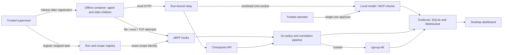
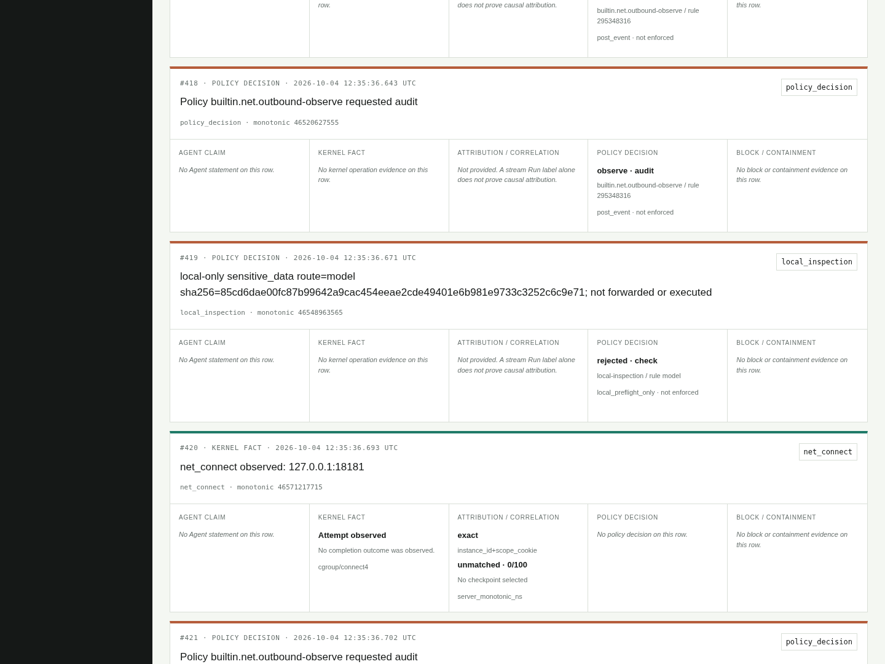

# AgentShield-eBPF

Controlled execution, kernel visibility, and local request checks for AI agent workloads.

AgentShield runs agent workloads in offline containers with resource limits. A trusted supervisor registers each task before execution. Local model/MCP checks apply content and approval rules, while eBPF records kernel activity. The Go control plane combines those observations with the agent's reported intent, policy decisions, and containment outcomes in an evidence timeline.

The implementation uses CO-RE eBPF, cgroup v2, Docker, Go, and SQLite, with a Python SDK and Next.js dashboard. Its controlled Linux 6.8 workflow passed **137/137 integration checks**, including 111 for offline launch, local inspection, and lifecycle handling.

[Architecture](docs/architecture.md) · [Controlled launch](docs/controlled-launch.md) · [Local checks](docs/local-inspection.md) · [Validation](docs/validation.md)

## What it does

- The supervisor prepares a stopped container init, binds its exact cgroup leaf, verifies registration, and then releases the workload. Agent processes and ordinary local stdio MCP children share that scope.
- Docker network isolation covers IPv4/IPv6 TCP and UDP, including while Core is stopped. CPU, memory, swap, process/thread, and runtime limits bound execution; approved source is mounted read-only.
- Before an integration proceeds, local model checks validate JSON, body size, sensitive values, and selected credential patterns. MCP checks validate tool names, required string arguments, path/value rules, and pinned tool definitions. Responses are local inspection receipts.
- Trusted single-use approvals identify the Run, route, raw-body SHA-256, and expiry. Content and tool rules remain mandatory. Per-Run attempt budgets and a checker-wide concurrency limit bound inspection work.
- `openat` and `execve` tracepoints capture attempts; `connect4`/`connect6` audit TCP and enforce exact-tuple policies. Exec policies can trigger identity-checked, post-event `cgroup.kill` containment.
- Agent claims, kernel observations, policy decisions, and containment results retain separate types. Local checks are recorded as `local_preflight_only`; SQLite stores the timeline for inspection in the desktop dashboard.

## Architecture



Docker's network namespace supplies offline isolation; eBPF supplies kernel observation and TCP policy enforcement. Local inspection validates request bodies and returns a receipt. [Read the design](docs/architecture.md).

## From request to evidence

A controlled workload sends a local model-check request through its Run-bound relay. Core validates the complete JSON body, applies sensitive-content rules, and requires a trusted approval bound to the exact bytes. The resulting receipt and minimal evidence identify the route, digest, and decision. The same Run's timeline also includes kernel activity and any runtime policy response.



*Dashboard production build reading the running Linux 6.8 guest Core through a test-only, read-only serial bridge on 2026-10-04. [Capture provenance and results](docs/validation.md).*

## Validation snapshot

Results for commit `9d7e28f`, recorded on 2026-10-04:

| Check | Observed result |
| --- | --- |
| Controlled workflow integration | **137/137 passed**: 111 offline/inspection/lifecycle checks plus 26 managed-mainline checks |
| External application traffic | **0 bytes received** from tested IPv4/IPv6 TCP/UDP attempts; receivers verified with positive controls |
| Resource enforcement | Actual OOM kill, task-limit hit, and CPU throttling observed; timeout ended the container |
| Trusted finish | Empty exited scopes stayed active through delayed monitoring, then finished through the supervisor |
| Inspection persistence | **49 records and their IDs preserved** after Core restart; SQLite integrity check passed |
| Go suite with race detection | **444 passing test/subtest results**, 68.3% statement coverage |
| Python SDK / supervisor and launcher | **12 / 21 passing tests** |

Experiments used x86_64 Linux `6.8.0-146-generic` and rootful Docker 28.4.0 inside a QEMU TCG guest. The earlier four-hook, two-compiler, two-kernel CO-RE matrix remains separately documented. [Validation](docs/validation.md) describes the measured scope; [development plans](docs/roadmap.md) cover broader integration and evaluation.

## Get started

For source development, use Go 1.25+, Python 3.10+, and Node.js 22 or 24. The Linux runtime uses cgroup v2, kernel BTF, Clang/LLVM 18, libbpf headers, and system SQLite; controlled container launch also uses rootful Docker.

```sh
go test ./...
python -m unittest discover -s sdk/python/tests -v
python -m unittest discover -s sandbox/tests -v
go run ./cmd/agentshield version
npm --prefix dashboard ci
npm --prefix dashboard run typecheck
npm --prefix dashboard run build
```

Choose a walkthrough:

- Offline workload with local request checks: [controlled launch](docs/controlled-launch.md) and [model/MCP inspection](docs/local-inspection.md).
- Kernel audit, correlation, and containment: [managed runtime](docs/managed-runtime.md), using `agentshield serve` on a dedicated Linux VM.
- Container audit demonstration: [demo guide](docs/demo-guide.md), using a host Core and Compose-managed dashboard and sandbox.
- Dashboard development: [dashboard guide](dashboard/README.md), using an authenticated synthetic fixture.

## Repository map

| Path | Responsibility |
| --- | --- |
| [`bpf/`](bpf/) | CO-RE programs, scope/enforcement maps, event ABI |
| [`cmd/`](cmd/) | Core CLI, trusted container init/relay, object inspection, and fixtures |
| [`internal/`](internal/) | Registration, local inspection, runtime policy, correlation, evidence, storage, and APIs |
| [`sdk/python/`](sdk/python/) | Run-scoped checkpoint client |
| [`sandbox/`](sandbox/) | Trusted supervisor, controlled Docker launcher, and audit demonstration |
| [`dashboard/`](dashboard/) | Next.js desktop interface |
| [`configs/`](configs/) | Runtime policy bundles and schema |
| [`scripts/`](scripts/) | Build, test, and Linux acceptance commands |
| [`docs/`](docs/) | Architecture, operating guides, and validation |

## Contributing and license

See [CONTRIBUTING.md](CONTRIBUTING.md) for checks and [SECURITY.md](SECURITY.md) for the trust model and reporting guidance. AgentShield-eBPF is available under the [MIT License](LICENSE).
