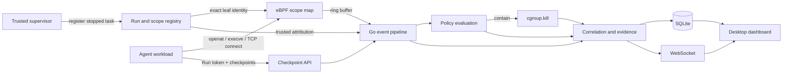
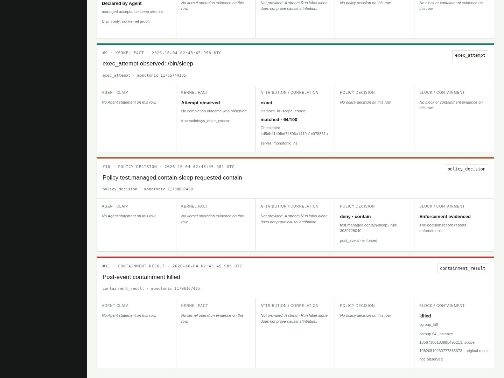

# AgentShield-eBPF

**Kernel-level visibility and policy enforcement for AI agent workloads.**

AgentShield connects what an agent reports with what its Linux workload attempts. A trusted supervisor registers each task, eBPF captures file, process, and TCP activity, and a Go control plane builds an evidence timeline with policy decisions and containment outcomes.

The system brings together **CO-RE eBPF, cgroup v2, Go, SQLite, a Python SDK, and a Next.js dashboard**. Its core workflow has been exercised on Linux 6.8 with real kernel hooks, TCP rejection, task containment, and evidence queries after restart.

[Architecture](docs/architecture.md) · [Run locally](docs/managed-runtime.md) · [Validation](docs/validation.md) · [Contributing](CONTRIBUTING.md)

## What it does

- **Binds evidence to a trusted task.** Exact-leaf cgroup registration combines independently checked kernel identity with per-instance and per-registration identifiers. The supervisor registers a stopped task before releasing it.
- **Observes activity at the kernel boundary.** `openat` and `execve` tracepoints record access and execution attempts; `connect4` and `connect6` hooks capture TCP destinations and enforce exact address/port allowlists.
- **Responds at the appropriate layer.** TCP denial happens synchronously in the connect hook. Exec policies can trigger a separate, identity-checked `cgroup.kill` action against the registered task.
- **Preserves the origin of each record.** Agent checkpoints, kernel observations, policy decisions, and containment results have distinct types. Correlation adds scored temporal and tool context within the trusted Run.
- **Makes the result inspectable.** Redacted SQLite evidence supports per-Run queries after restart. The desktop dashboard provides Overview, Live Trace, Evidence, History, Policies, and Diagnostics.

## Architecture



The kernel handles synchronous TCP decisions. The control plane handles registration, correlation, storage, and post-event containment through bounded queues. [Read the design](docs/architecture.md).

## A task, from intent to outcome

In the managed fixture, the Python SDK announces a tool invocation, the kernel records an `execve` attempt for `/bin/sleep`, and a policy requests containment. The executor validates the task's cgroup identity and writes to `cgroup.kill`. The supervisor observes SIGKILL and an empty leaf before finishing the Run.



*Production dashboard rendering API snapshots from the Linux 6.8 run on 2026-10-04. The browser used local HTTP replay of those snapshots. [Evidence provenance](docs/validation.md).*

## Validation snapshot

Results for commit `ebcfa7e`, recorded on 2026-10-04:

| Check | Observed result |
| --- | --- |
| Go suite, including race detection | 395 passing test/subtest results; 67.4% statement coverage |
| Python SDK / trusted supervisor | 12 / 16 passing tests |
| CO-RE load and attach | Four hooks across two Clang 18 builds and two guest kernels |
| TCP policy checks | IPv4/IPv6 exact-tuple allowlisting; rejected connections returned `EPERM` |
| Managed lifecycle on Linux 6.8 | 24 runtime checks plus 2 restart checks passed for each compiler build |
| Evidence persistence | Saved Run evidence readable after restart; SQLite integrity check passed |

The runtime experiments used x86_64 QEMU guests with minimal initramfs environments. Linux 6.8 is the demonstrated operating baseline. [Validation](docs/validation.md) records the experiment scope and reproducible checks; [development plans](docs/roadmap.md) cover compatibility, durability, and broader evaluation.

## Get started

For source development, use Go 1.25+, Python 3.10+, and Node.js 22 or 24. The Linux runtime additionally uses cgroup v2, kernel BTF, Clang/LLVM 18, libbpf headers, and system SQLite.

```sh
go test ./...
python -m unittest discover -s sdk/python/tests -v
python -m unittest discover -s sandbox/tests -v
go run ./cmd/agentshield version
```

```sh
npm --prefix dashboard ci
npm --prefix dashboard run typecheck
npm --prefix dashboard run build
```

Choose a walkthrough:

- **Full lifecycle and containment:** [managed runtime](docs/managed-runtime.md), using `agentshield serve` on a dedicated Linux VM.
- **Container audit demonstration:** [demo guide](docs/demo-guide.md), using the host Core and Compose-managed dashboard and sandbox.
- **Dashboard development:** [dashboard guide](dashboard/README.md), using an authenticated synthetic evidence fixture.

## Repository map

| Path | Responsibility |
| --- | --- |
| [`bpf/`](bpf/) | CO-RE programs, scope/enforcement maps, event ABI |
| [`cmd/`](cmd/) | Core CLI, object inspection, and acceptance fixtures |
| [`internal/`](internal/) | Registration, event pipeline, policy engine, evidence, storage, APIs |
| [`sdk/python/`](sdk/python/) | Run-scoped checkpoint client |
| [`sandbox/`](sandbox/) | Trusted supervisor and container demonstration |
| [`dashboard/`](dashboard/) | Next.js desktop interface |
| [`configs/`](configs/) | Policy bundles and schema |
| [`scripts/`](scripts/) | Build, test, and Linux acceptance commands |
| [`docs/`](docs/) | Architecture, operating guides, and validation |

## Contributing and license

See [CONTRIBUTING.md](CONTRIBUTING.md) for checks and [SECURITY.md](SECURITY.md) for the trust model and reporting guidance. AgentShield-eBPF is available under the [MIT License](LICENSE).
