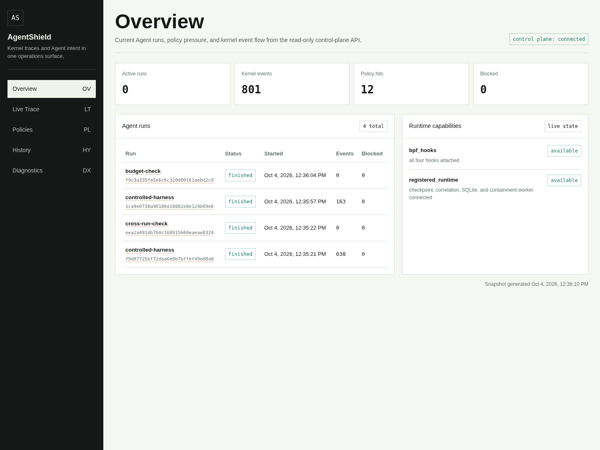

# Validation

The controlled-workflow experiment used commit `9d7e28f3f84034e1598694fb713a3260d2240298`, recorded on 2026-10-04. It passed **137/137 integration checks**, covering offline containers, local inspection, trusted finish, and the existing managed runtime. The [machine-readable summary](validation/2026-10-04-offline-inspection.json) records counts, observations, binary hashes, and source-record hashes.

## Environment and checks

Experiments used x86_64 Linux `6.8.0-146-generic`, cgroup v2, and rootful Docker 28.4.0 with containerd 1.7.28 and runc 1.3.0 inside a QEMU TCG guest. Core and static init were rebuilt from the tested revision. Their hashes matched the binaries executed in the guest.

| Integration group | Passing checks | What was exercised |
| --- | ---: | --- |
| Offline container and local inspection | 81 | Stopped preparation, registration, isolation, resources, relay, content/MCP rules, approval, budgets, and delayed finish |
| Finish and abnormal scope regression | 21 | Three repeated delayed finishes, remaining members, live-root migration, and child cgroups |
| Inspection persistence | 1 | All 49 local inspection records and IDs preserved across Core restart |
| Core stop and timeout | 8 | Relay unavailability, persistent network isolation, whole-container exit, and cleanup |
| Existing managed mainline | 26 | Checkpoints, correlation, four hooks, real cgroup.kill, authentication, realtime evidence, and restart queries |
| **Total** | **137** | **111 new-workflow checks plus 26 mainline checks** |

The total counts distinct integration assertions. Repeated runs are recorded separately and do not increase it.

| Software check | Recorded result |
| --- | --- |
| Go suite with race detection | 444 passing test/subtest results, zero failures/skips; 68.3% statement coverage |
| Python SDK | 12 passing tests |
| Python supervisor and launcher | 21 passing tests |
| Build/static checks | Go vet, module integrity, generated bindings, BPF/shell syntax, Core/static-init builds, and Windows cross-build passed |
| Dashboard | Typecheck and production build passed; live pages captured from the running guest Core |

## Direct observations

For the network isolation tests, controlled receivers first passed positive controls for IPv4/IPv6 TCP and UDP. The tested agent, ordinary stdio subprocess, and container after Core shutdown delivered **0 application bytes** in both receiver observation rounds. The primary isolation mechanism was Docker `network=none`, independent of Core availability. The observation concerns these traffic paths and receivers.

The resource-limit test used 128 MiB memory, zero swap, 64 tasks, and CPU quota `50000 100000`. Deliberate over-limit child workloads produced one OOM kill, one task-limit event, and 234 throttled CPU periods; the main workload exited with status 0. These are functional enforcement observations. The launcher's default memory budget is 512 MiB.

Request inspection tests covered exact-byte approval binding, concurrent single consumption, expiry, sensitive-content rejection, pinned MCP definitions, argument scope, strict JSON, and attempt budgets; all passed. A relay request of 256 KiB + 1 returned **413** and added **zero** Core inspection records. Allowed receipts retained `mode=local_only`, `forwarded=false`, and `executed=false`.

To check trusted finish, the test driver kept the main workload and three repeated `/bin/true` samples awaiting finish for three 1.1-second observation intervals after root exit. The held leaf reported `populated 0`; Runs stayed active until supervisor finish, then became finished. Separate injections of remaining members, live-root migration, and child cgroups produced the expected failures and token revocation.

SQLite integrity checks passed. Closing and reopening Core preserved all 49 inspection records and IDs; container and held-leaf cleanup left the test resources empty. Closed-database operations were covered by the software regression suite.

## Visual evidence and provenance



The overview and [sensitive-content rejection screenshot](assets/local-inspection-live.png) are unchanged captures from the dashboard production build. A read-only serial bridge in the test apparatus fetched live GET responses from the running guest Core while preserving the guest's offline network configuration.

Capture timestamps and screenshot hashes are included in the public JSON summary. The archived evidence bundle's checksum list was verified against all **111 listed files**. The complete raw logs, databases, captures, and independent drivers remain operator-held; the public summary identifies its source files by SHA-256.

## Earlier CO-RE compatibility matrix

The [earlier summary](validation/2026-10-04.json) targets `ebcfa7e`. Debian Clang 18.1.8 and Ubuntu Clang 18.1.3 objects each loaded and attached all four hooks on Linux 6.8 and 7.0 x86_64 guests. File/exec markers, empty arguments, truncation, IPv4, IPv6 loopback, a four-nonzero-word IPv6 address, and exact-tuple TCP blocking were checked.

Allowlisted attempts returned `ECONNREFUSED` at destinations without listeners, establishing passage through the hook. Rejected tuples returned `EPERM`. The current run reused the unchanged BPF object and repeated the four-hook and managed path on Linux 6.8. Compatibility follow-up is tracked in [development plans](roadmap.md).

The earlier [containment screenshot](assets/containment-desktop.png) used HTTP replay of saved real-kernel API snapshots; its provenance remains associated with the earlier summary. The current screenshots above use the live serial bridge.

## Reproduce source checks

```sh
go test -race ./...
go vet ./...
go mod verify
make verify-generated
make test-lifecycle
make test-policy
make test-runtime
make test-sdk
make test-supervisor
npm --prefix dashboard ci
npm --prefix dashboard run typecheck
npm --prefix dashboard run build
```

Use a race-enabled Go toolchain and compatible native C compiler. See the [dashboard guide](../dashboard/README.md) for its synthetic browser fixture.

## Reproduce runtime checks

On a dedicated Linux VM, follow [BPF build](bpf-build.md), [managed runtime](managed-runtime.md), [controlled launch](controlled-launch.md), and [local inspection](local-inspection.md). The repository provides the launcher and component fixtures:

```sh
make bpf-object
make verify-bpf-object
CGO_ENABLED=1 make build
CGO_ENABLED=0 go build -o bin/sandbox-init ./cmd/sandbox-init
sudo make accept-audit
sudo make accept-lifecycle
sudo make accept-network-block
```

To reproduce the full 137-assertion experiment, also supply the independent archived test driver, guest image/kernel, controlled receivers, and resource/finish fault injections. The commands above are component checks and preparation steps. Record positive receiver controls, exact limits, complete-leaf exit, saved Run IDs, restart queries, and binary hashes alongside results.

Keep raw evidence owner-only. [Development plans](roadmap.md) describe broader portability, executor integration, and performance/association-quality measurements.
